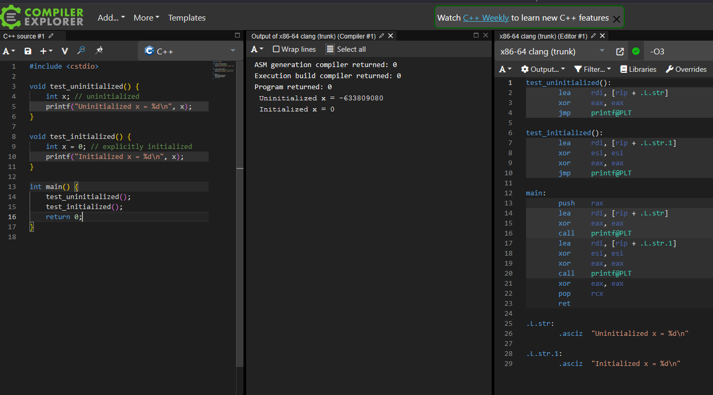

<!-- _class: lead -->

# Class introduction

### ... done with support of


        

---
# Agenda
 - Class introduction, class vs struct
 - Access specifiers
 - Life cycle of class
 - Inheritance, Encapsulation, Interface class
 - Virtual table
 - Keywords
 - Possible problems, tips and tricks
 - Demo, Lessons learned, Q&A, ...


---
# Class introduction, class vs struct
- Class is elementary structure of C++ language
- Class uses by default `private` access specifier
- Class is intended to use encapsulation - limiting access to member variables in order to prevent i.e. unintended modifications
- [Read more about encapsulation here](https://www.geeksforgeeks.org/encapsulation-in-cpp/)

```cpp
class Person
{
     std::string name;
     uint8_t age;
};     
```


---
# Class introduction, class vs struct
```cpp
class Person
{
     std::string name; // Private by default

public:
     void setName(std::string newName) { name = newName; }
     std::string getName() { return name; }     
};

int main() {
     Person john;
     john.setName("John Doe");
     std::cout << john.getName() << std::endl;
     return 0;
}
```

--- 
# Class introduction, class vs struct
- `Struct` is the same as `class`, but used `public` specifier by default
  - Struct can be inherited, can contain methods, can contain virtual table, ...
- Due to historical reasons it is used mostly for data collection
- "POCO" - Plain Old C Object

---
# Class introduction, class vs struct
```cpp
struct Person
{
     std::string name;
     uint8_t age;
};

int main()
{
     Person john;
     john.name = "John Doe"; //This is valid, because all members are public
     john.age = 42;

     return 0;
}
```

---
# Access specifier
- `public`
  - Variable/function can be modified/called from **outside** of instance
- `protected`
  - Variable/function can be modified/called only from **inside of instance or it's child**
- `private`
  - Variable/function can be modified/called only from **inside** of instance.

---
# Class introduction, class vs struct
- Member variables
- Member functions
- ⚠️ Be careful about uninitialized variables
- https://en.wikipedia.org/wiki/Uninitialized_variable

---
<style>
img[alt~="center"] {
  display: block;
  margin: 0 auto;
}
</style>



---
# Class introduction
- Demo time

---
# Life cycle of class
- Compiler creates several function for you
- Constructor
  - Function that is called upon instance creation
  - User can alter it in order to set initial values to variables or force user to set them
  - "Parametrized" vs "default" constructor

---
# Life cycle of class
- Destructor
  - Called at the end of class lifetime (i.e. when object goes out of scope. Warning, this mechanism is not guaranteed!)
  - Can be used to cleanup resources (free allocated memory, end connection, close sockets, free handles, unsubscribe to messages, ...)
  - ⚠️ Always declare destructor as virtual!

---
# Life cycle of class
- Rule of three
  - Copy constructor
  - Copy assignment operator 
  - Move semantics was introduced in C++11 standard
- Rule of five
  - Move constructor
  - Move assignment operator
- [Read more here](https://en.cppreference.com/w/cpp/language/rule_of_three.html)

---
# Life cycle of class
- Demo time

--- 
# Encapsulation, Inheritance, Interface class
**Encapsulation**
- Limiting access to member variables
- Creating "read-only" variables
- Validating input/output of variables

---
### Encapsulation
```cpp
class Person
{
     int age;
public:
     void setAge(int newAge)
     {
          if ((newAge > 0) && (newAge < 100)) 
          {
               age = newAge;
          } else
          throw std::exception("Invalid age");
     }
};
```

--- 
### Inheritance
```cpp
class Animal
{
protected:     
     unsigned int legs;

public:
     virtual void setLegs(unsigned int newLegs) {
          legs = newLegs;
     }

     virtual unsigned int getLegs() const {
          return legs;
     }

}
```

--- 
### Inheritance
```cpp
class Dog : public Animal
{
}

int main()
{
     Dog lassie;
     lassie.setLegs(4);

     return 0;
}
```

--- 
### Inheritance
```cpp
class Dog : public Animal
{
}

int main()
{
     Animal lassie = new Dog;
     lassie->setLegs(4);

     return 0;
}
```

--- 
# Interface class (Abstract class)
- Defining interface, forcing user to fulfill requirements
- You can't instantiate it
```cpp
class NoisyAnimal{
     virtual void makeNoise() = 0; //this enforce us to implement makeNoise function
}

class NoisyDog : public NoisyAnimal
{
     void makeNoise() {
          std::cout << "HAF HAF!" << std::endl;
     }
}
```

---
```cpp
int main()
{
     NoisyAnimal animal; //This will throw compilation error
     NoisyDog dog;       //This is fine
     dog.makeNoise();
     return 0;
}
```

--- 
# Encapsulation, Inheritance, Interface class
- Demo time

---
# Virtual table
- Table that is containing relationship between parents/children and calls proper functions
- Created by using keyword `virtual` somewhere in class (or eventually others that imply `virtual`, i.e. `final`, `override`)
- Used for runtime polymorphism
  - Polymorphism -> instance of class behaving like other type
  - Remember `Animal lassie = new Dog;`
- [Read more here](https://en.wikipedia.org/wiki/Virtual_method_table)

---
# Virtual table
- Demo time

---
# Keywords
- `this`
  - Returns address of current instance. Useful when I am registering myself to some publisher.
- `override` (vs overload)
  - Overrides method in parent
  - Checks whether method I am trying to override truly exists in parent
  - Prevents unintended overloading (functions of same name but with different parameters)
---

# Keywords
- `final`
  - If used on class, prevents further inheritance
  - If used on method, prevents overriding this method
- `const`
  - Prevents modification of given variable
  - If used on function, prevents any member variable modification
- `explicit`
  - Prevents unintended conversion of input parameters

 # Keywords
 - Demo time 

---
# Possible problems, tips and tricks
- Always initialize your member variables (at least with `{}`);
  - Otherwise in `Release` or `-O3` build these values will obtain random values!
- Size of empty class is not zero. It is at least 1 byte in order to allocate some memory (to be capable of using `this` keyword)
  - [Read more here](https://www.geeksforgeeks.org/why-is-the-size-of-an-empty-class-not-zero-in-c/)

---
## Possible problems, tips and tricks
- Diamond inheritance problem
```cpp
class Parent {
     void foo() = 0;
}

class ChildA : public Parent{
     void foo() { 
          std::cout << "Foo from A"; }
}

class ChildB : public Parent{
     void foo() { 
          std::cout << "Foo from B"; }
}
```

---
```cpp
class Grandchild : public ChildA, ChildB
{
}

int main()
{
     Grandchild joe;
     joe.foo();     //Which "foo" override is called? From ChildA or ChildB? 
                    //This results in compilation error
     return 0;
}
```

--- 
# Demo time
- C uninitialized variables
- Simple class, encapsulation
- Abstract class
- Examining default constructor, , parametrized constructor, destructor
- Virtual destructor issue
- final, const, override

---
# Lessons learned
- Initialize your variables, otherwise they **WILL** get random values (at least with `{}`)
  - Otherwise in `Release` or `-O3` they they are not implicitly zeroed
- Declare your destructor as **virtual**
- If possible, use as many keywords as possible (`const`, `override`, `final`, `explicit`, ...)
  - Compilers are very smart and thus performance optimization is not goal of using i.e. `const` keyword. Readability and maintainability is your goal.

---
# Q&A