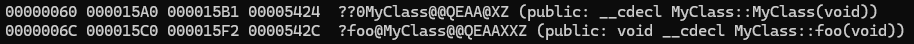
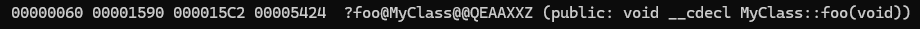
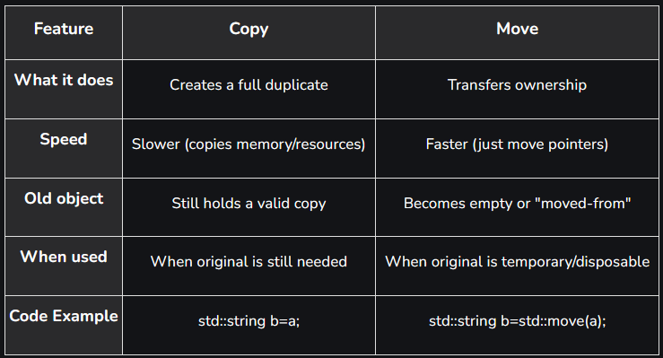

---
title: Special member functions
author: Zdenko Pavlik
lang: en-US
institute: Scheidt&Bachmann Slovakia s.r.o.    
pdf-engine: lualatex
mainfont: "Segoe UI Emoji"
cmd: pandoc slideshow_02_special_member_functions.md -t beamer -o slideshow_02_special_member_functions.pdf
classoption:
  - t
  - aspectratio=169
---

# Special member functions


\begin{center}
... done with support of
\end{center}

::: {.center}
{ height=64px }
:::

---

# Agenda
- Lessons learned from previous lesson (class introduction)
- Examples from previous lesson
- Special member function
- Compiler generated functions
- Copy semantics, Move semantics
- Rule of Zero / Three / Five
- Copy elision & Move elision
- Practical examples
 
---

# Lessons learned from previous lesson (class introduction)

---

# Lessons learned from previous lesson (class introduction)
- Virtual destructor
   - Always declare destructor as `virtual`, otherwise it may not be called at all.
- Uninitialized variables
   - Always initialize your variables, at least with `{}`, otherwise those variables will obtain random values in release version.
- Encapsulation
   - Do not populate your variables as `public` to improve personal comfort. Other users can break functionality of your class.
-  Use keywords like `const`, `override`, `final`
   - It will give a hint to other developers how to behave to your class.

---

# Example of usage from previous lesson

---

# Example of usage from previous lesson
 - Inheritance (`Logger` example)
   - Reusing functionality
 - Polymorphism (`std::vector<Animal> zoo` example)
 - Polymorphism (`foo(Parent class)` example)

---

# Example of usage from previous lesson
 - Demo time

---

# Special member function

---

# Special member function
- Constructor (default or parametrized)
- Destructor
- **Copy** constructor
- **Copy** assignment operator
- **Move** constructor
- **Move** assignment operator

---

# Compiler generated functions
Compiler will generate some functions for you, depending on your code. Even simple class will generate at least default constructor and destructor.

These functions (many times are correctly written) enables your class to be easily constructible, movable or copyable without developer's input.

But often (especially when class contains **pointer as member variable**) it needs to be handled by user!

---

# Compiler generated functions

```cpp
class MyClass
{
public:
    void foo()
    {
        std::cout << "foo" << std::endl;
    };

private:
    int i{};
};
```

::: {.center}

:::


# Compiler generated functions
[[DISCLAIMER]] This may not be true, even though I though different. :) 

For very simple classes (without member variables) the code can be optimized that much, that even constructor is omitted.
```cpp
class MyClass
{
public:
    void foo()
    {
        std::cout << "foo" << std::endl;
    };
};
```

::: {.center}

:::

---

# Copy semantics / Move semantics
## Copy semantics
Copy semantics, also known as value semantics, is a principle in programming where an assignment or copy operation creates a new, independent, and equivalent object with its own copy of the original object's data, rather than sharing the underlying resource. This ensures that modifications to one object do not affect the other, preserving the independence of both objects. This is a common default in C++ for fundamental types but requires custom implementation for complex classes to avoid issues like shallow copying.


[TL;DR:] Ability to create **INDEPENDENT COPIES** of our instances.

---

# Copy semantics / Move semantics
## Move semantics
Move semantics is a feature that allows our program to transfer ownership of resources (like memory, files, etc.) from one object to another instead of copying them. This results in faster performance, less memory usage, better efficiency, especially with big objects (like std::vector, std::string, or file streams).


[TL;DR:] Ability to create **REUSE RESOURCES** between instances.

---

# Copy semantics / Move semantics
## Comparison
::: {.center}
{ height=192px }
:::

[\textcolor{blue}{Read more here.}](https://www.geeksforgeeks.org/cpp/stdmove-in-utility-in-c-move-semantics-move-constructors-and-move-assignment-operators/)

---

# Copy semantics / Move semantics
## Interesting fact
**Move semantics** were introduced in C++11 standard. Since then we can use `std::move` function.

\
[\textcolor{blue}{std::move}](https://en.cppreference.com/w/cpp/utility/move.html)

[\textcolor{blue}{C++ move semantics from scratch}](https://cbarrete.com/move-from-scratch.html)

[\textcolor{blue}{What is move semantics?}](https://stackoverflow.com/questions/3106110/what-is-move-semantics)


---

# Rule of Zero / Three / Five
Constructor \
Destructor \
**Copy** constructor \
**Copy** assignment operator \
**Move** constructor \
**Move** assignment operator

---

# Rule of Zero / Three / Five

\ 

\begin{center}
\begin{tabular}{ ||c||c|c|c|| } 
\hline
                            & Rule of Zero & Rule of Three & Rule of Five\\ 
\hline
\hline
Destructor                  & no & YES & YES\\ 
\hline
Copy constructor            & no & YES & YES\\ 
\hline
Copy assignment operator    & no & YES & YES\\ 
\hline
Move constructor            & no & no & YES\\ 
\hline
Move assignment operator    & no & no & YES\\ 
\hline
\end{tabular}
\end{center}

---

# Rule of Zero / Three / Five
## Best practices
### C.20: If you can avoid defining any default operations, do
\
This rule is also known as “the rule of zero“. That means, that you can avoid writing any custom constructor, copy/move constructors, assignment operators, or destructors by using types that support the appropriate copy/move semantics. This applies to the regular types such as the built-in types bool or double, but also the containers of the Standard Template Library (STL)such as std::vector or std::string.
\ 

[\textcolor{blue}{Cpp best practices, C.20}](https://isocpp.github.io/CppCoreGuidelines/CppCoreGuidelines#Rc-zero) \
[\textcolor{blue}{Modernes C++}](https://www.modernescpp.com/index.php/rule-of-zero-or-six/)

---

# Rule of Zero / Three / Five
## Best practices
### C.20: If you can avoid defining any default operations, do

```cpp
class NamedVector
{ 
public: // Consider this section to be private
    std::string name;
    std::vector<int> data;
};

NamedVector nv;                 //Default constructor
nv.name = "My vector";
nv.data = {1, 2, 3, 4, 5};
NamedVector anotherVector{nv};  //Copy constructor
NamedVector anotherVector2;
anotherVector2 = nv;            //Copy assignment operator
```

---

# Rule of Zero / Three / Five
## Best practices
### C.20: If you can avoid defining any default operations, do

Demo time

---

# Rule of Zero / Three / Five
## Best practices
### C.21: If you define or =delete any default operation, define or =delete them all
\
The big six are closely related. Due to this relation, you have to **define** or **=delete** all six. Consequently, this rule is called “the rule of six“. Sometimes, you hear “the rule of five“, because the default constructor is special, and, therefore, sometimes excluded. \
\vspace{5mm}
[\textcolor{blue}{Cpp best practices, C.21}](https://isocpp.github.io/CppCoreGuidelines/CppCoreGuidelines#Rc-five) \
[\textcolor{blue}{Modernes C++}](https://www.modernescpp.com/index.php/rule-of-zero-or-six/)

---

# Rule of Zero / Three / Five
## Best practices
### C.21: If you define or =delete any default operation, define or =delete them all
\
Demo time

---

# Copy elision & Move elision
\
Sometimes it is beneficial to delete copy and move operations.

```cpp
class NMvNCp //Not moveable, not copyable
{
public:
    NMvNCp(const std::string name) : m_name(name) {}
    ~NMvNCp() = default;

    NMvNCp(const NMvNCp& other) = delete;                // copy constructor
    NMvNCp& operator=(const NMvNCp& other) = delete;     // copy assignment
    NMvNCp(NMvNCp&& other) noexcept = delete;            // move constructor
    NMvNCp& operator=(NMvNCp&& other) noexcept = delete; // move assignment

private:
    std::string m_name{};
};
```

# Copy elision & Move elision
\
```cpp
    NMvNCp bob{"Bob"};

    NMvNCp joe(bob); 
        // Compilation error, copy constructor is deleted
    NMvNCp joe = std::move(bob); 
        // Compilation error, move assignment is deleted
```

---

# Comparison with std::unique_ptr

std::unique_ptr contains following member functions:

 - `(constructor)` 
 - `(destructor)` 
 - `operator=` assigns the unique_ptr
   - move assignment operator

```cpp
    std::unique_ptr<int> number1 = std::make_unique<int>(42);
    std::unique_ptr<int> number2 = std::make_unique<int>(15);
    number1 = std::move(number2); //ok, enforces move
    number1 = number2; //error, enforces copy
```

TL;DR:
    `std::unique_ptr` is movable, but not copyable.


[\textcolor{blue}{Cpp reference}](https://en.cppreference.com/w/cpp/memory/unique_ptr.html) \
[\textcolor{blue}{operator=}](https://en.cppreference.com/w/cpp/memory/unique_ptr/operator=.html)\

---

# Practical examples
## Shallow vs deep copy
\
Common problem is when class contains pointer as member variable. This is evaluated as fundamental data type in C++ and therefore just **value can be copied**, no the content. This results in double free in destructor. \
\
**Shallow copy** happens when user accidentally copies just value of pointer - BAD. \
**Deep copy** happens when user intentionally allocates new memory and copies content - GOOD

---

# Practical examples
## Shallow vs deep copy
\
Demo time

---

# Lessons learned

- **C.20** If you can avoid defining any default operations, do
- **C.21** If you define or =delete any default operation, define or =delete them all
- Be careful with classes that contains pointer as member variable

---

# Q&A
---
