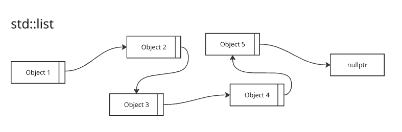

---
title: Containers
author: Zdenko Pavlik
lang: en-US
institute: Scheidt&Bachmann Slovakia s.r.o.    
pdf-engine: lualatex
mainfont: "Segoe UI Emoji"
cmd: pandoc chapter_edu_03_containers.md -t beamer -o chapter_edu_03_containers.pdf
classoption:
  - t
  - aspectratio=169
---

# Containers

\begin{center}
... done with support of
\end{center}

::: {.center}
{ height=64px }
:::

---

# Agenda
- Lessons learned from previous lesson (Rule of 5)
- Intro into containers
- Establishing containers for demonstration 

 
---

# Lessons learned from previous lesson (Rule of 5)
Class has several function, that are used when we alter lifecycle of class (either by new creation, assigning of copying from already existing classes). Each of them can be default, user defined or deleted.

---

# Lessons learned from previous lesson (Rule of 5)
## constructor
  `NamedClass()` \
  Called when class is created. Can be default or parametrized. \
  `NamedClass newClass;`  

## copy constructor
  `NamedClass(const NamedClass& other) // copy constructor` \
  Called when class is constructed from instance of another class (of the same type). \
  Member data are **copied**. \
  `NamedClass newClass = std::copy(otherClass);`

## move constructor
  `NamedClass(NamedClass&& other) noexcept // move constructor` \
  Called when class is constructed from instance of another class (of the same type). \
  Member data are **moved** and instance being moved from is not safe to use anymore! \
  Benefit is reuse of resources and in general it is faster than copying. \
  `NamedClass newClass = std::move(otherClass);`

---

# Lessons learned from previous lesson (Rule of 5)
## copy assignment operator
  `NamedClass& operator=(const NamedClass& other) // copy assignment` \
  Called when content of the class is overridden by other class using **copy**. \
  `newClass = std::copy(otherClass);`

## move assignment operator
  `NamedClass& operator=(NamedClass&& other) noexcept // move assignment` \
  Called when content of the class is overridden by other class using **move**. \
  `newClass = std::move(otherClass);`  

---

# Lessons learned from previous lesson (Rule of 5)
## Examples

---

# Intro into containers
what are containers, why they exists

# Benefits of using std containers
for (auto i : items){}

find_if

safety bounds checking (std::vector[10] on 5 vector of 5 elements -> not accessing random memory)
.at(10)

algorithms (std::sort)

---

# Choosing containers for demonstration
map, list, vector, array

---

# Common characteristics
push, pop, ...

---

# Organization in memory
Organization of map, vector, list, array

::: {.center}
{ height=100px }
:::

--- 

# Algorithm complexity (BigO notation)

\ 

\begin{center}
\begin{tabular}{ ||c||c|c|c|c|| } 
\hline
                    & Access by index & Search  & Insertion         & Deletion\\  
\hline
\hline
std::array          & O(1)            & O(N)    &  N/A(fixed size)  & N/A(fixed size) \\ 
\hline
std::vector         & O(1)            & O(N)    &  O(N) or O(1)     & O(N) or O(1) \\ 
\hline
std::list           & O(N)            & O(N)    & O(1)              & O(1) \\ 
\hline
std::map            & O(log N)        &  O(log N)   & O(log N)      & O(log N)\\ 
\hline
\end{tabular}
\end{center}

---

# Demonstration of adding/accessing/removing element 

## On std::array
## On std::list
## On std::vector
## On std::map

---

# Disclaimer binary tree (balanced)

---

# Applied BigO notation on container

---

# Explaining logarithm complexity on std::map

# Lessons learned
Think before you choose a container, because it can have tremendous impact on performance. 
As well you can cause unintended memory deallocation/allocation.

# links
https://www.geeksforgeeks.org/cpp/where-to-use-a-particular-stl-container-cpp/

