---
title: Containers
author: Zdenko Pavlik
lang: en-US
institute: Scheidt&Bachmann Slovakia s.r.o.    
pdf-engine: lualatex
mainfont: "Segoe UI Emoji"
cmd: pandoc chapter_edu_03_containers.md -t beamer -o chapter_edu_03_containers.pdf
classoption:
  - t
  - aspectratio=169
---

# Containers


\begin{center}
... done with support of
\end{center}

::: {.center}
{ height=64px }
:::

---

# Agenda
- Lessons learned from previous lesson (Rule of 5)
- Intro into containers
- Establishing containers for demonstration 

 
---

# Lessons learned from previous lesson (Rule of 5)
Class has several function, that are used when we alter lifecycle of class (either by new creation, assigning of copying from already existing classes). Each of them can be default, user defined or deleted.

---

# Lessons learned from previous lesson (Rule of 5)
## constructor
  `NamedClass()` \
  Called when class is created. Can be default or parametrized. \
  `NamedClass newClass;`  

## copy constructor
  `NamedClass(const NamedClass& other) // copy constructor` \
  Called when class is constructed from instance of another class (of the same type). \
  Member data are **copied**. \
  `NamedClass newClass = std::copy(otherClass);`

## move constructor
  `NamedClass(NamedClass&& other) noexcept // move constructor` \
  Called when class is constructed from instance of another class (of the same type). \
  Member data are **moved** and instance being moved from is not safe to use anymore! \
  Benefit is reuse of resources and in general it is faster than copying. \
  `NamedClass newClass = std::move(otherClass);`

---

# Lessons learned from previous lesson (Rule of 5)
## copy assignment operator
  `NamedClass& operator=(const NamedClass& other) // copy assignment` \
  Called when content of the class is overridden by other class using **copy**. \
  `newClass = std::copy(otherClass);`

## move assignment operator
  `NamedClass& operator=(NamedClass&& other) noexcept // move assignment` \
  Called when content of the class is overridden by other class using **move**. \
  `newClass = std::move(otherClass);`  

---

# Lessons learned from previous lesson (Rule of 5)
## Examples

```cpp
    NamedClass var1{"var1"};
    
    NamedClass var2{var1};             // Calling copy constructor
    NamedClass var3 = std::move(var1); // Calling move constructor

    var1 = var2;            // "Calling copy assignment"
    var3 = std::move(var1);  // "Calling move assignment"
```

---

# Intro into containers

Containers are pre-prepared storage for our data. There is no unique "best for all scenarios" container, each container is optimized for different purpose.
Containers designed to store large amount of data in most effective way.

- generic (templated to any type, evaluated during compilation)
  - `std::list<int>`
  - `std::list<std::string>`
- safe to use, tested by tons of users
- heavily optimized

# Benefits of using std containers

- `for (auto i : items){}`
- `container.find_if()`
- safety bounds checking (`std::vector[10]` on 5 vector of 5 elements -> not accessing random memory)
  - `container.at(10)`
- algorithms (`std::sort`)


---

# Choosing containers for demonstration
I decide to choose three similar containers. All of them provide (almost) same functions, but performance differs a lot.

- `std::list`
- `std::vector`
- `std::deque`

---

# Common characteristics

- `.emplace_back()` - optimized way to add at the end
- `.insert(position)` - insert element on given position (i.e. after 5th element)
- `.at(position)` - random access

---

# Container brief overview

---

# Organization in memory
Organization of **vector**, list, deque (and map, array)

::: {.center}
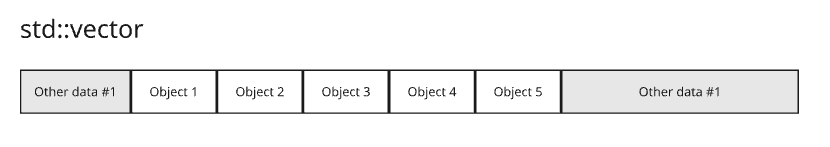{ height=100px }
:::

---

# Adding element
Adding element to **vector**, list, deque (and map, array)

::: {.center}
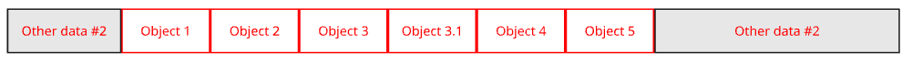{ height=100px }
:::

---

# Organization in memory
Organization of vector, **list**, deque (and map, array)

::: {.center}
{ height=150px }
:::

---

# Adding element
Adding element to vector, **list**, deque (and map, array)

::: {.center}
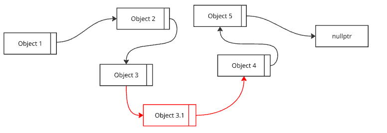{ height=150px }
:::

---

# Organization in memory
Organization of vector, list, **deque** (and map, array)

::: {.center}
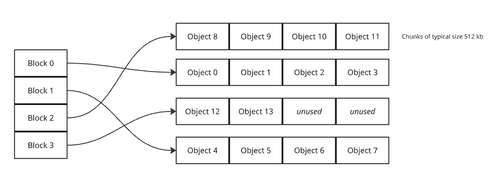{ height=150px }
:::

---

# Adding element
Adding element to vector, list, **deque** (and map, array)

::: {.center}
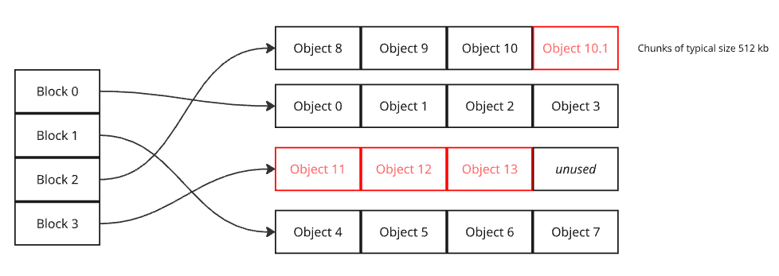{ height=150px }
:::

---

# Organization in memory
Organization of vector, list, deque (and **map**, array)

::: {.center}
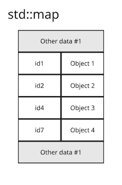{ height=200px }
:::

---

# Adding element
Adding element to vector, list, deque (and **map**, array)

::: {.center}
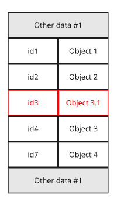{ height=200px }
:::

---

# Disclaimer map (binary tree (balanced))
::: {.center}
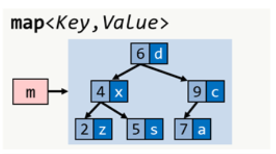{ height=200px }
:::


[\textcolor{blue}{More here - Red black tree}](https://en.wikipedia.org/wiki/Red%E2%80%93black_tree)


---

# Organization in memory
Organization of vector, list, deque (and map, **array**)

::: {.center}
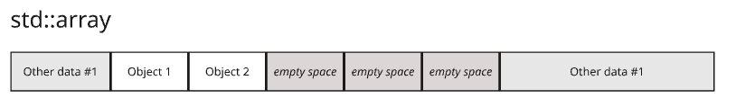{ height=100px }
:::

---

# Adding element
Adding element to vector, list, deque (and map, **array**)

::: {.center}
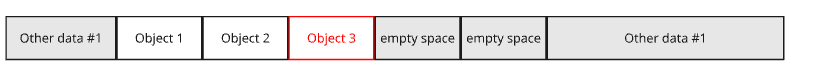{ height=100px }
:::

--- 

# Algorithm complexity (BigO notation)

\ 

\begin{center}
\begin{tabular}{ ||c||c|c|c|c|| } 
\hline
                    & Access by index & Search  & Insertion         & Deletion\\  
\hline
\hline
std::array          & O(1)            & O(N)    &  N/A(fixed size)  & N/A(fixed size) \\ 
\hline
std::vector         & O(1)            & O(N)    &  O(N) or O(1)     & O(N) or O(1) \\ 
\hline
std::list           & O(N)            & O(N)    & O(1)              & O(1) \\ 
\hline
std::map            & O(log N)        &  O(log N)   & O(log N)      & O(log N)\\ 
\hline
std::deque          & O(1)            & O(N)    & O(N) or O(1)      & O(N) or O(1) \\ 
\hline
\end{tabular}
\end{center}

---

# Demonstration


# Lessons learned
Think before you choose a container, because it can have tremendous impact on performance. 
As well you can cause unintended memory deallocation/allocation.

 - Do I need to add elements frequently?
 - Do I need to remove elements frequently?
 - Do I need to add elements in the middle ?
 - Do I need to have continuous memory?
 - etc..

# How to choose (cheat-sheet)

::: {.center}
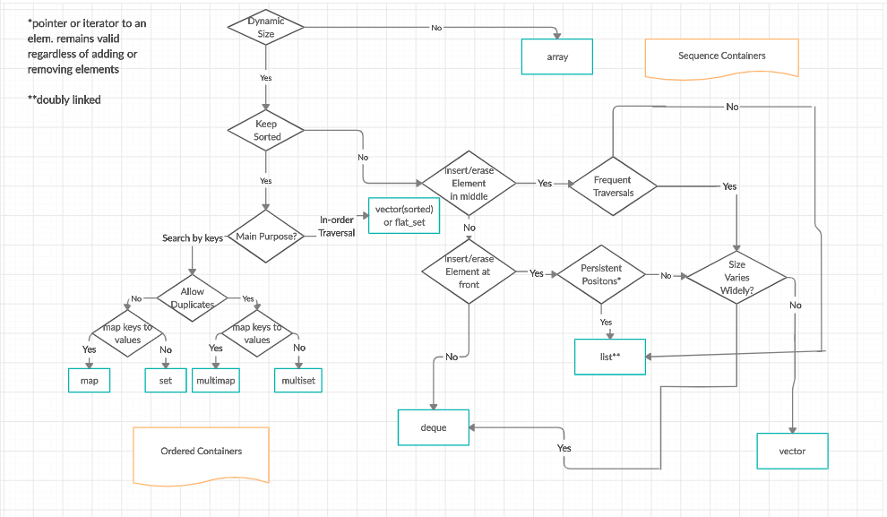{ height=250px }
:::

# Links
[\textcolor{blue}{Where to use particular container}](https://www.geeksforgeeks.org/cpp/where-to-use-a-particular-stl-container-cpp/)

 Link to image from previous slide


